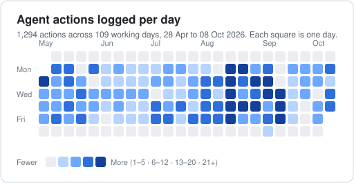
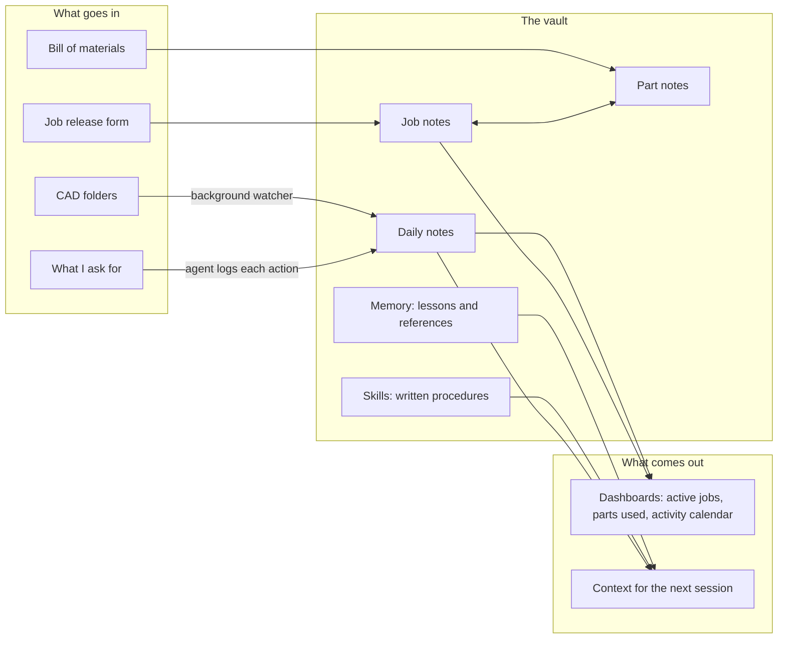

# Engineering Vault

> A personal engineering knowledge base that doubles as the working memory for my AI agents. I write nothing down twice, and the agent starts every session already knowing my job.

> **Showcase repository.** The vault itself holds my employer's job and design data and stays private. This repo documents how the system works. The files under [`examples/`](examples/) are real in structure and rewritten in content: every job number, customer, part number and path is invented.

---

## At a glance

Counted from the vault on 8 October 2026.

| | |
|---|---|
| **1,294** | agent actions logged, each with a time, a job and a kind of work |
| **109** | working days covered, from 28 April 2026 |
| **10** | agent actions on a typical day; 36 on the busiest |
| **87** | written lessons the agent loads at the start of every session |
| **16** | skills: written procedures the agent runs from one sentence |
| **1,785 / 78** | part notes and job notes, cross-linked |
| **559** | CAD events logged by a background watcher, with no typing |

## Why I built it

I am a mechanical designer at FoxFab, which builds custom low-voltage switchboards and power-connection equipment. Two things kept costing me time that had nothing to do with design.

**Writing things down.** Keeping a record of what I did, on which job, and why, meant stopping work to do it. Every note pulled my attention off the job in front of me, so the record was always thinner than it should have been.

**Starting from zero.** Each new conversation with an AI assistant began with no idea how my jobs are organised, which folders must never be touched, or what went wrong last week. I corrected the same mistakes again and again.

The vault fixes both with one idea: **the place I keep my knowledge is the same place the agent reads its context from.**

## What it is

An [Obsidian](https://obsidian.md) vault, which is a folder of plain text notes that link to each other, with [Claude Code](https://claude.com/claude-code) working inside it as an agent.

- **One note per job**, filled in from the job's release form.
- **One note per part**, linked to every job that used it.
- **One note per day**, where the agent records what it did and a background watcher records what I modelled.
- **A memory folder**: one short file per lesson learned, loaded into every session.
- **Skills**: written procedures for recurring tasks.

## What it changed

| | Before | Now |
|---|---|---|
| **Record keeping** | Writing down what I did took time away from design and broke my focus | The log writes itself: 1,294 entries over 109 working days, none typed by me |
| **Reusing parts** | Easier to model a new part than to find out whether a suitable one already existed | The vault finds existing parts that fit the job I am on, so I reuse them |
| **Agent quality** | Every session started from nothing and repeated old mistakes | What the agent learns persists into every session |
| **Volume** | — | About ten pieces of work handed to the agent on a typical day |

## How it works: four case studies

### [1. An agent with a memory →](docs/agent-memory.md)

Every mistake that gets found and fixed is written down the same session, as a general rule. Those rules load at the start of every conversation. There are 87 of them so far, plus 54 reference notes. The page shows how a lesson is written, what makes one useful, and how the collection is kept from rotting.

### [2. The daily rituals →](docs/daily-rituals.md)

"Good morning" produces a briefing on open items and active jobs, starts the CAD watcher and checks for anything that happened while nobody was looking. "Logging off" stops the watcher, turns the day's lessons into memory and backs everything up. Both now also run on a schedule.

### [3. Skills: one sentence, a whole procedure →](docs/skills.md)

"Let's review job 20417" opens the right assembly and prints the right documents. Each skill is a written procedure, with the traps found along the way recorded inside it.

### [4. A work log you can audit →](docs/work-log.md)

Every action the agent takes is logged with the time, the job and the kind of work, and states plainly what was *not* done or not verified. The same entries feed each job's history and the activity calendar above.

## Guardrails

An agent that can act on a real engineering drive needs firm limits. These are standing rules it loads every session:

- **The job archive is read-only.** The agent reads and copies out. It never edits, moves or deletes there, apart from a short list of named, approved tools.
- **Tests run in a sandbox**, never against a live job.
- **Nothing prints, and no long CAD operation starts, without a go-ahead.** A print job cannot be recalled.
- **My open SolidWorks session is mine.** The agent closes only what it opened and never exits the application.
- **Team code changes go through review.** The agent may back up my own vault; it may never push to a shared repository.
- **Time is read from the clock.** A log entry never carries a guessed timestamp.

## Limits, and what it would take to scale

This is one engineer's system, and it is built so that it does not have to stay that way. Notes are kept per user, part numbers are filed by each designer's own prefix, and the lessons and skills are plain text files that can be shared as they are. Another designer could be set up in it without a redesign.

Two honest constraints:

- **It depends on a paid AI subscription.** The notes and dashboards work without one. The agent, and everything it does, does not.
- **The background watcher runs on my laptop.** It stops when the laptop sleeps or shuts down, or when the AI session that started it closes. The morning routine checks the file system directly to fill any gap.

## Also in the vault

- **A live CAD watcher.** A background Python script checks the active jobs' CAD folders every ten seconds and logs each new part and assembly to the day's note.
- **Agents that drive CAD.** Skills that build SolidWorks parts, sheet-metal parts and assemblies by script, then measure the result to confirm it.
- **Standards on tap.** The switchboard and transfer-switch safety standards distilled into references the agent consults when a design question comes up.
- **Dashboards.** Active jobs by stage, parts ranked by how often they are used, and a calendar of CAD and agent activity.

## Tech

Obsidian (Dataview, Templater, Kanban, Periodic Notes) · Claude Code (memory, skills, scheduled tasks, subagents) · Python · PowerShell · Git

## Related

- [Engineering Tool Hub](https://github.com/LambertBadong/engineering-tool-hub): the desktop automation suite built alongside this vault. Its [write-up on building with AI](https://github.com/LambertBadong/engineering-tool-hub/blob/main/docs/building-with-ai.md) tells the stories behind several of the lessons shown here.

---

Built by **Lambert Badong** · [lambertbadong.github.io](https://lambertbadong.github.io)
