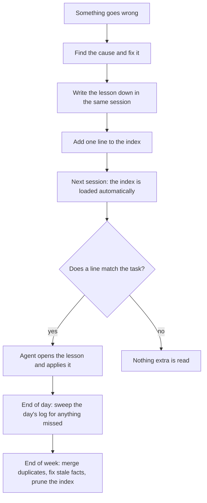

# An agent with a memory

[← Back to overview](../README.md)

## The problem

An AI assistant does not remember yesterday. Each conversation starts blank. On real work that means explaining the same folder layout, restating the same rules and, worst of all, watching it repeat a mistake you corrected last week.

The individual mistake is rarely the cost. The cost is working out the diagnosis a second time.

## The fix

A folder of small text files. Each file holds **one** fact or lesson. An index file lists them, one line each, and that index is loaded at the start of every session. When a line looks relevant to the task, the agent opens the full file.

| Kind | Count | What it holds |
|---|---|---|
| **Lessons** | 87 | A correction or a confirmed way of working, with the reason |
| **References** | 54 | Where things are and how they behave: tools, folders, procedures |
| **Projects** | 6 | Ongoing work that the code and files do not explain on their own |
| **About me** | 1 | My role, who I work with, how I like to work |

See the [trimmed index](../examples/memory/MEMORY.md) and [four complete lessons](../examples/memory/).

## How a mistake becomes a rule



Two details matter.

**Same session, not end of day.** An explanation written an hour later has already lost the false trail that made the problem hard to find, and the false trail is the useful part.

**The shape, not the story.** "The delete removed eleven functions" never happens again. "A cut between two text markers can silently take everything in between; list what exists before and after" happens constantly.

## What a useful lesson contains

Take a real one, rewritten with nothing confidential in it:

```markdown
---
name: read-the-named-sheet
description: When reading a release form, select the sheet by name, never the active one
metadata:
  type: feedback
---

When reading a job's release form, always open the sheet called "Form" by name.
Never use whichever sheet happens to be active.

**Why:** The workbook has several sheets. The active one is simply the tab that
was open when someone last saved the file. On many older jobs that is the
nameplate sheet, which has a completely different layout. A bulk import of 48
past jobs came back with the model, enclosure, quantity and amperage blank for
exactly this reason, and nothing reported an error.

**How to apply:** Select the sheet by name. If it is missing, stop and ask.
Do not fall back to the active sheet.
```

Every good lesson has the same four parts:

1. **The rule**, in one line.
2. **How it looked before it was understood.** The symptom is what you meet first next time.
3. **What made it invisible.** Here: nothing errored, the fields were simply blank.
4. **What to check first.** The line that actually saves the time.

## Keeping it honest

A memory that only grows becomes noise. Three habits stop that.

- **Corrections are recorded as corrections.** If a lesson turns out to be wrong, the file says so and says when. One reference note carries this line: the written procedure said to start a background process one way for a month after the method had changed, and a session that followed it faithfully had to undo its own work.
- **A bar for saving.** A lesson is kept only if it would change what the agent does in a future session. A routine day adds nothing.
- **A weekly clean-up.** Duplicates are merged, stale facts fixed and the index pruned.

## The result

Agent quality is very good now, and the reason is simple: what it learns persists into every session. A problem that once took two hours to diagnose is a five-minute check the second time, because the note that describes it is already loaded.

---

[← Back to overview](../README.md) · Next: [The daily rituals →](daily-rituals.md)
