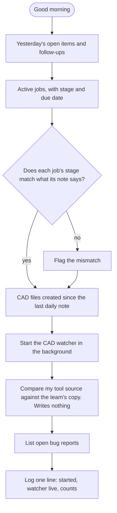
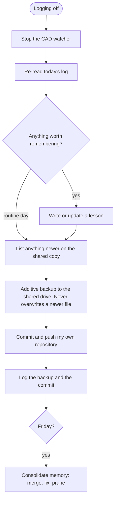

# The daily rituals

[← Back to overview](../README.md)

Two phrases bookend the working day. Neither asks for confirmation: I said the phrase so that I would not have to.

## "Good morning"



The briefing appears in the conversation. An illustrative one, for invented jobs:

```
Open from yesterday
  • J20417 – two bus-bar drawings still need a title-block date
  • Follow-up: confirm lug spacing with the electrical designer

Active jobs (3)
  J20417  Harbourview Medical     Drawing check   due 18 Sep
  J20431  Northgate Data Hall     Started         due 26 Sep
  J20388  Kestrel Water Plant     Programming     —

Checks
  ⚠ J20388 is marked Programming, but its note still says "waiting for the model"
  ⚠ 4 parts were created on J20431 on Saturday with no daily note. Backfilled.

CAD watcher running. Tool source: no changes upstream. Open bug reports: 0.
```

### Two checks that exist because something went wrong

**Stage against the note.** A job's stage is one field at the top of its note. Everything reads that field: the briefing, the job board, the watcher. A job once sat at "Started" for weeks while its own notes said it was waiting on someone else, and nothing flagged it, because only the field was being read. The morning check now compares the two.

**Files against the calendar.** If I model on a day when no session is running, there is no daily note and no watcher. One such day produced 27 files that surfaced only by accident the following week. The morning now asks the file system directly what was created since the last note, and writes a back-dated entry for anything it finds.

## "Logging off"



The backup rules were each earned:

- **Additive only.** The copy never deletes anything at the destination.
- **Never overwrite a newer file.** An earlier version of this step did, and silently replaced a fix someone else had made twenty minutes before. The work had to be rebuilt from an email. The backup now skips any file that is newer at the destination, and lists those files first so they can be pulled in.
- **My own repository only.** The end-of-day push never touches shared team repositories. Anything bound for those goes through a branch and a review.

## On a schedule

Since October 2026 both rituals also run on their own on weekdays, at the start and the end of the day, without a phrase. Each one first checks whether it has already run and skips itself if so. The scheduled runs carry tighter limits than the interactive ones: they may not touch SolidWorks, shared repositories or a job's stage.

## What is still imperfect

The background watcher is not a service. It runs on my laptop, so it stops when the laptop sleeps or shuts down, and when the AI session that started it is closed. It stops without an error, so nothing announces the gap.

That is why the morning does not trust it: the file-system check runs regardless and fills in whatever was missed. I would rather have a check that assumes the watcher stopped than a watcher I have to believe.

---

[← An agent with a memory](agent-memory.md) · [Back to overview](../README.md) · Next: [Skills →](skills.md)
