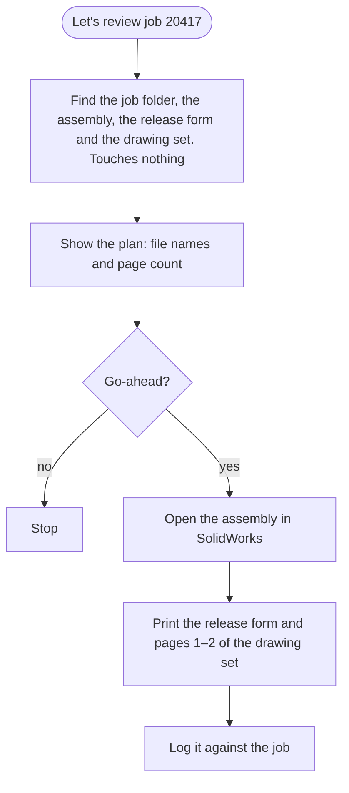

# Skills: one sentence, a whole procedure

[← Back to overview](../README.md)

## What a skill is

A skill is a folder containing a written procedure and, where needed, a script. Its first lines say when it applies. When I say something that matches, the agent loads the procedure and follows it, in place of working out an approach from scratch.

The difference is repeatability. Asked cold to "set me up to review a job", an agent will improvise, and improvise differently each time. With a skill it does the same correct thing every time, including the parts I learned the hard way.

## The sixteen

| Group | Skills |
|---|---|
| **Starting a job** | Find a reference job · List the parts that need to be bought · Set up a small job cloned from a reference |
| **Releasing a job** | Generate the BOM from the assembly · Fill the BOM and pull drawings · Check drawings for common mistakes · Build and print the manufacturing packet |
| **Reviewing** | Set up a job review |
| **Fixing** | Renumber a duplicated part end to end |
| **CAD by script** | Build a solid part from a drawing or dimensions · Build and check sheet-metal parts |
| **Reference** | Switchboard safety standard · Transfer-switch safety standard · Design guide |
| **Printing** | Batch-print documents · Printer help |

## A worked example: setting up a job review

Before I review a job I need the top-level assembly open in SolidWorks and two things on paper: the job's release form, and the first two pages of the matching electrical drawing set. Finding and printing those by hand is a few minutes of clicking through folders, every time.

Now it is one sentence: *"let's review job 20417"*.

The full procedure is in [`examples/skills/job-review/SKILL.md`](../examples/skills/job-review/SKILL.md).

### Why it stops and asks

A print job on the office printer cannot be cancelled from a desk. So the skill always resolves everything first, shows exactly what it will open and print, and waits. That pause is deliberate and is written into the procedure.

### The traps are part of the skill

The most valuable section of a skill is the one headed *Gotchas*: things that went wrong once and are now written down where the agent will read them before acting.

- **Two cells both look like the model number.** The release form has the model in two places, and on some jobs they disagree. Only one of them matches the drawing set's file name. The skill names the right one and treats the other as a last resort with a loud warning.
- **The printer has two names.** One program wants the name as it is displayed; another wants it as the print server knows it. Give both the same name and the result is "printed 1 of 2": one document prints and the other fails without a word. The skill derives both forms and keeps them apart.
- **Everything prints black and white.** Colour needs a permission the agent does not have, so the skill says so up front and does not pretend otherwise.

None of these could be guessed. Each cost time once. Now each costs nothing.

## Skills that check their own work

The CAD skills go further than following steps. After building a part they measure it: dimensions are read back from the model, the volume is compared after each feature, and a sheet-metal part is flattened to confirm it can actually be cut and bent. A script that reports success without checking is the failure these skills are built to avoid.

## How a skill gets written

1. I do the task by hand with the agent, a few times.
2. The steps that repeat are written down as a procedure.
3. Anything that goes wrong is added under *Gotchas* the same day.
4. Steps that must be exact, such as locating files or matching names, move into a script the procedure calls, so they are not re-reasoned each time.

---

[← The daily rituals](daily-rituals.md) · [Back to overview](../README.md) · Next: [A work log you can audit →](work-log.md)
