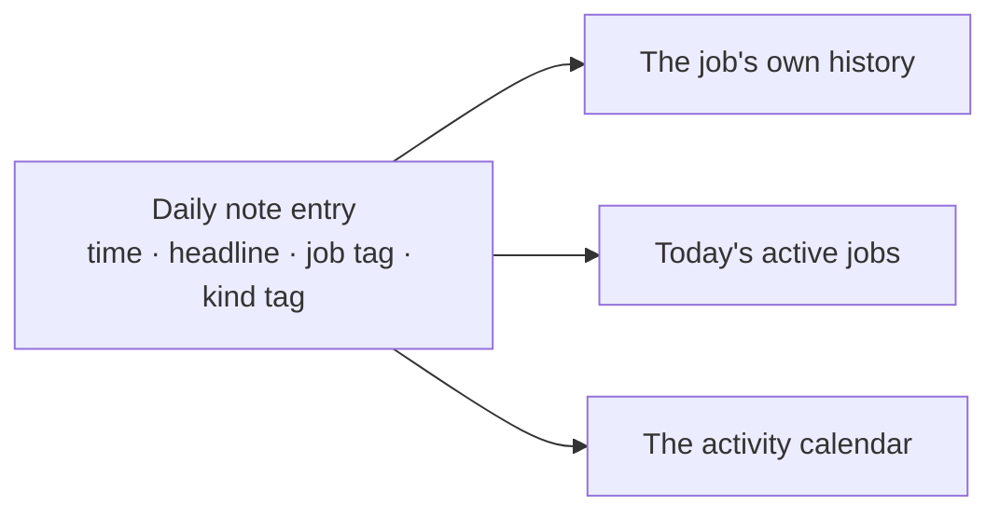

# A work log you can audit

[← Back to overview](../README.md)

## The rule

Every tangible thing the agent does is written to that day's note, without asking. No "shall I log this?".

A thank-you, a quick lookup or a clarifying question is not logged. A file created, a document printed, a decision made, a bug fixed or a procedure run is.

## One entry

```markdown
- 10:18 — **J20417 review set up.** Opened the top-level assembly; sent the release
  form and pages 1–2 of the drawing set (49 pages) to the printer, black and white.
  A second assembly with "Door Closed" in its name sits in the same folder; the
  plain one was opened. [job:: J20417] [kind:: review]
```

Four things are always there:

| Part | Why |
|---|---|
| **The time**, read from the system clock | A guessed timestamp makes the whole log untrustworthy, so the agent checks the clock first, every time |
| **A one-line headline** | So the day can be skimmed |
| **What was actually done**, including what it chose between | Here: which of two similar assemblies it opened |
| **Tags** for the job and the kind of work | These are what the dashboards read |

A complete sample day is in [`examples/vault/Daily Notes/2026-09-14.md`](../examples/vault/Daily%20Notes/2026-09-14.md).

## It records what was not done

This is the part I value most. An entry does not only say what happened. It says what is unfinished and what was never checked. Real entries, condensed and with names removed, read like this:

> *Pull request opened, not merged, not deployed. Tested by composing the email only; no mail window was opened. Not clicked in the live panel. The subject line is my guess. Waiting on a go-ahead to merge.*

> *Repair proven in memory, nothing saved. Five of six broken links fixed; the sixth has no matching feature on the part.*

An agent that reports only success is useless as a record, because you cannot tell "done and verified" from "done, probably". Writing down the gap is what makes the rest believable.

## One entry, three places

The tags turn a flat list into something that can be queried. The same line shows up in three views, with no copying:



- **The job's history.** Each job note has a section that gathers every entry tagged with its number, from every day.
- **Today's active jobs.** A finished job reappears on today's list if it was touched today.
- **The activity calendar.** A count of entries per day, drawn as a calendar.

## What the log shows

Counted on 8 October 2026:

| | |
|---|---|
| Entries | 1,294 |
| Working days | 109 |
| Typical day | 10 |
| Recent average | 13 a day over the last 30 notes |
| Busiest day | 36 |
| Tied to a specific job | 420 |

The most common kinds of work:

| Kind | Entries | What it covers |
|---|---|---|
| Daily routines | 212 | Morning briefings and end-of-day wrap-ups |
| Backups | 146 | Vault copies and repository pushes |
| Job work | 132 | Work logged directly against a job |
| Tool building | 205 | Building and releasing my automation tools |
| CAD | 33 | Scripted modelling and model repairs |
| Manufacturing packets | 30 | Assembling and printing packets |
| Fixes | 28 | Bugs found and fixed |
| Printing | 27 | Documents sent to the printer |

## The second feed

Beside the agent's entries, each daily note has a second section that nobody types either. A background script checks the active jobs' CAD folders every ten seconds and records each new part and assembly: 559 events so far.

It logs creations only, not every save, and it groups a burst of files into one entry, so copying forty parts into a job is one line and not forty.

## Why this matters

I used to keep this record by hand, which meant stopping design work to do it. Now it is more complete than I ever managed and costs me nothing.

It also closes a loop. Tomorrow's session reads today's note. The log is not only a record for me; it is how the agent picks up where it left off.

---

[← Skills](skills.md) · [Back to overview](../README.md)
